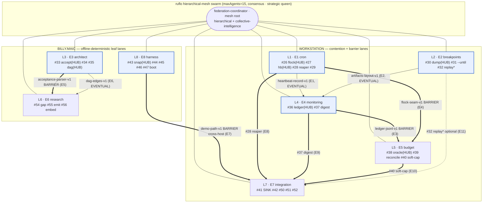

# Dispatch 1.0 — Federated Multi-Agent Parallel Workplan

> **Scope.** *How* a federation of 8 parallel agent lanes executes the existing
> 38-issue dispatch-1.0 roadmap (`ReclaimByDesign/dispatch`, issues **#26–#56**)
> across a 3-day solo-dev sprint. Two layers, merged in one document:
>
> 1. **Coordination layer** — topology, two-plane comms, seam contracts, sync
>    gates, shared-file protocol, failure/recovery, host placement, daily cadence,
>    autonomy compliance.
> 2. **Execution layer (ruflo V3 harness)** — the swarm boot sequence, the per-lane
>    SPARC + agent-staffing engine, the hooks lifecycle, and the memory model that
>    drive each issue from Specification to PR.
>
> It does **not** restate *what* to build; the roadmap (`02-roadmap.json`) owns
> that. All tool/agent names are verified against `.claude-flow/CAPABILITIES.md`
> and the `ruflo-*` plugin registry.

---

## 0. Scope caveat — `/v3-core-implementation` is a pattern source, not a literal fit

The `/v3-core-implementation` skill targets **claude-flow's own TypeScript DDD
codebase** — a microkernel, `inversify` dependency injection, DDD bounded contexts
(Entity / ValueObject / AggregateRoot), and a SQLite repository layer with Jest
tests. **dispatch is BASH + PYTHON** (`pipeline.sh`, `common.sh`,
`services/architect/*.py`, `smoke.sh`). None of the microkernel / inversify /
SQLite-repository machinery applies here.

What we **do** take from the skill is the language-agnostic core: the
`Task()` / `agent_spawn` orchestration pattern, the SPARC phase decomposition, and
the **test-first** ethos. The actual per-lane work uses the **harness primitives +
SPARC methodology + the `ruflo-core` / `ruflo-sparc` agents** directly against
bash/python files. Do **not** instantiate the skill's TypeScript scaffolding, DI
container, or class hierarchy in this repo — cite it only as the inspiration for
the Task()/agent-spawn + SPARC + test-first harness pattern.

---

## 1. Federation topology (coordination) + boot sequence (execution)

One ruflo **hierarchical-mesh** swarm, booted verbatim from
`.claude-flow/config.yaml`. The **mesh root** (a `hierarchical-coordinator`) gives
anti-drift control; a `mesh-coordinator` peer fabric carries the lateral seam
edges between the 8 leads.

### Boot sequence (DAY-0 / KICKOFF, operator-attended, run once)

```
1. mcp__ruflo__swarm_init(topology="hierarchical-mesh", maxAgents=15, strategy="consensus")
2. mcp__ruflo__hive-mind_init(queen_type="strategic")     # strategic queen = 3-day planning
3. mcp__ruflo__agent_spawn  x8                            # one persistent lane-lead per epic
4. mcp__ruflo__agent_pool                                 # 6 floating coder/tester agents
5. mcp__ruflo__claims_board                               # seed per-issue + per-file tokens
6. #51 publishes smoke-sections-v1  (HARD GATE — §6.3)    # before ANY lane writes smoke
7. operator answers DEC-1 #48 + DEC-2 #49 via AskUserQuestion → `decided` labels
```

- **Mesh root (1):** `federation-coordinator` (`hierarchical-coordinator` +
  `collective-intelligence-coordinator` for the #41 join) — the only caller of
  `coordination_orchestrate` / `coordination_sync` across lanes.
- **Persistent leads (8):** one per epic. **Each lead doubles as the worker
  session for its lane's HUB issue** (its own session = its own issue = its own
  branch) and orchestrates every non-hub child as a *separate* detached worker.
- **Floating pool (6):** `type:coder` / `type:tester` agents, `claims_*`-assigned
  and **time-multiplexed by day** so live concurrency never exceeds 15.

Count: `1 coordinator + 8 leads (9 persistent) + 6 floaters = 15` at cap. Leads
are `agent_terminate`'d on epic-done (fires `session-end`), so the typical live
count sits below 15.



*Solid `==>` = BARRIER edge (consumer hard-blocks until producer contract frozen).
Thin `-->` = EVENTUAL edge (consumer codes against the frozen stub before merge).
Dotted `-.->` = optional stretch leg of the #41 barrier. The **two comm planes**
(durable GitHub spine + fast ruflo within-run) ride every edge — §2.*

---

## 2. Two-plane communication model

| Plane | Mechanism | Role |
|-------|-----------|------|
| **Durable spine (GitHub)** | pipeline labels (`queued→…→done`, common.sh, per-stage) · federation labels (`seam-ready/<hub#>`, `decided`, `seam-frozen`, `done-pending-merge`) · fenced `CONTRACT:` comments · PR bodies/threads | Source of truth **across pipeline ticks + lane/host restarts**. Worker contract: all durable knowledge lives here. |
| **Fast within-run (ruflo)** | `hive-mind_broadcast` · `memory_store`/`hive-mind_memory` key `contracts/<name>-vN` (namespace `dispatch-sprint`) · `claims_*` · `coordination_sync`/`coordination_consensus` · `agentdb_semantic-route` | Sub-second wakeup + work assignment **within one run**. A **rebuildable cache** — GitHub wins on conflict. |

### The seam-ready handshake (pub/sub verbs)

The handshake is fired by the **hooks lifecycle** (§4): the `post-task` hook on the
producer's hub PR runs the PUBLISH verbs; the `notify` hook carries the fast
broadcast.

**PUBLISH** (producer lane, on hub PR-open/merge — ordered so the label flips **last**):

```
1. gh issue comment <hub#> --body '```CONTRACT: <name>-vN … status: ready```'
2. mcp__ruflo__memory_store key=contracts/<name>-vN
   mcp__ruflo__hooks_notify  -> hive-mind_broadcast {seam-ready, <name>-vN, <hub#>}
3. gh issue edit <hub#> --add-label seam-ready/<hub#>     # ← single commit point
```

**SUBSCRIBE** (consumer lane, before starting its dependent issue):

```
gate := gh issue view <hub#> --json labels  ⊇  seam-ready/<hub#>      # durable, authoritative
fast  := hive-mind_memory get contracts/<name>-vN                      # in-run wakeup
on hit → parse the LITERAL payload (never read producer source)
on restart → ruflo cache gone → rebuild from `gh issue view <hub#> --comments`
```

A producer that dies mid-publish leaves the comment present but the label absent
(label flips last) — the reconciler re-runs the missing verb idempotently.
**Prompt-injection defense:** only the authenticated producer posts the
authoritative CONTRACT comment and only a stage-owner can set a label, so
consumers trust the **label** (a privileged act), not arbitrary comment text —
issue body text stays untrusted data per the security posture.

### Federation labels to provision at kickoff (net-new)

These are **not yet in the repo** and must be created before Day-0 work begins —
`gh label create` (or `dt repo/ensure-labels`) — kept in a **distinct namespace**
from the issue state-machine labels (`queued → claimed → pr-open → in-review →
docs-pending → done`):

```
seam-ready/26  seam-ready/27  seam-ready/28  seam-ready/30  seam-ready/32
seam-ready/33  seam-ready/35  seam-ready/36  seam-ready/37  seam-ready/38
seam-ready/40  seam-ready/43  seam-ready/51
decided        seam-frozen    done-pending-merge
```

Without them, the handshake's label-flip step **fails silently on first use**.

---

## 3. Seam-contract table (the 6 hubs + the numbering seam)

§7.x verify slots are **not hardcoded here** — every lane reads its assigned slot
from #51's `smoke-sections-v1` map (§6.3). This corrects the earlier draft, whose
`verify:` numbers were fabricated and contradicted the roadmap issue bodies.

| Seam | Producer | Consumers | Contract shape (literal) | Publish | Consume |
|------|----------|-----------|--------------------------|---------|---------|
| **flock-seam-v1** | #26 | #40, #27 | `fn with_tick_lock`; env `DISPATCH_LOCK_FILE/_WAIT`; insertion = pipeline.sh pre-claim boundary; verify §7.x per smoke-sections-v1 | comment #26 + memory + broadcast, then `seam-ready/26` last | #40 BARRIER-gates on `seam-ready/26`, inserts guard at named point |
| **heartbeat-record-v1** | #27 | #36 | env `DISPATCH_TICK_ID`,`DISPATCH_RUN_RECORD`; line `<ts> event=started\|ended tick_id=… pid=…`; fns `tick_record_start/end` (common.sh); verify §7.x per smoke-sections-v1 | comment #27 + memory + broadcast, then `seam-ready/27` | #36 EVENTUAL — codes against frozen line stub before #27 merges |
| **artifacts-layout-v1** | #30 | #36, #32, #31 | `$DISPATCH_ARTIFACTS_DIR/<tick-id>/{workorder.txt,job-request.json,invoice.json,dag.json}`; verify §7.x per smoke-sections-v1 | comment #30 + memory + broadcast, then `seam-ready/30` | #36 EVENTUAL on `seam-ready/30`, reads invoice/job-request paths |
| **ledger-jsonl-v1** ⚠ | #36 | #39, #37 | `{tick_id,issue,stage,cost:{tokens_in,tokens_out,duration_seconds,model},label_before,label_after,timestamp}`; stage_vocab fixed; verify §7.x per smoke-sections-v1; `frozen-v1` | comment #36 (versioned) + memory + broadcast, then `seam-ready/36` | #39 **BARRIER** — cannot guess line shape; #37 EVENTUAL |
| **acceptance-parser-v1** | #33 | #54 | `sig _extract_acceptance(body:str)->list[str]` (services/architect); verify §7.x per smoke-sections-v1; `frozen-v1` | comment #33 + memory + broadcast, then `seam-ready/33` | #54 **BARRIER** — reuses exact signature |
| **oracle-window-v1** | #38 | #39, #40 | `usage_window()->{window_start,window_end,tokens_used,tokens_limit,plan_tier,fraction_used}`; verify §7.x per smoke-sections-v1; `frozen-v1` | comment #38 + memory + broadcast, then `seam-ready/38` | #39 reconciles ledger vs usage; #40 reads fraction vs DEC-1 #48 |
| **smoke-sections-v1** † | #51 | **all lanes** | committed §7.x map reconciling every lane's smoke slot incl. the L1/L2↔L8 host-boundary collisions | comment #51 + memory + broadcast Day-1 AM, then `seam-ready/51` | every lane requests its §7.NN from the map before writing any smoke block |

⚠ **ledger-jsonl-v1 is the load-bearing schema** — any post-freeze change forces
`ledger-jsonl-v2` + `seam-ready/36-v2` + re-notify #39; never mutate v1.
† **smoke-sections-v1** is the 7th, numbering seam — a **hard gate**, §6.3.

---

## 4. Per-lane execution engine — SPARC + agent staffing + hooks

Each issue is run by `ruflo-sparc:sparc-orchestrator` through SPARC
**Specification → Pseudocode → Architecture → Refinement(TDD) → Completion**.
**Test-first:** the issue's "## Test Procedure" (its `smoke-sections-v1` §7.x slot)
is written **first** in the Refinement/TDD phase, then the bash/python
implementation. **Completion = the lane worker OPENING its PR** — never merging
(worker contract). Hooks form the spine: `pre-task` (route + agent suggestion) at
issue start, `post-edit` after each change, `post-task` (learning + the seam-ready
PUBLISH) at issue done, `notify` (fast broadcast) firing the handshake,
`session-start`/`session-end` persisting lane state.

### Lane execution table

| Lane | Epic / issues | Lead agent (= hub session) | SPARC / worker agents | Host | Start gate |
|------|---------------|----------------------------|------------------------|------|-----------|
| **L1** | E1 cron — #26 flock(HUB), #27 hb(HUB), #28 reaper, #29 docs | `hierarchical-coordinator` lead = #26 | `ruflo-sparc:sparc-orchestrator` · `ruflo-core:coder` · `ruflo-testgen:tester`+`tdd-london-swarm` · `ruflo-core:reviewer` · `ruflo-docs:docs-writer`(#29) | workstation | Day-1 AM; #26 no deps; #27 after seam-ready/26; #28 ⟂ DEC-2 #49 |
| **L2** | E2 breakpoints — #30 dump(HUB), #31 --until, #32 replay* | `hierarchical-coordinator` lead = #30 | `sparc-orchestrator` · `ruflo-core:coder` · `ruflo-testgen:tester` · `ruflo-core:reviewer` | workstation | Day-1 AM (parallel to L1); #31 after #30; #32 stretch |
| **L8** | E8 harness — #47 boot, #43 snap(HUB), #44, #45, #46 | `mesh-coordinator` lead = #43 | `sparc-orchestrator` · `ruflo-core:coder` · `ruflo-testgen:tester`/`tdd-london-swarm` · `production-validator` | billy.maic | Day-1; #47 first, then #43; self-directed `/implement-task` |
| **L3** | E3 architect — #33 accept(HUB), #34, #35 dag(HUB) | `mesh-coordinator` lead = #33 | `sparc-orchestrator` · `ruflo-core:coder` · `ruflo-testgen:tester` · `ruflo-core:reviewer` | billy.maic | Day-2; #33 no hard deps; pure-offline |
| **L4** | E4 monitoring — #36 ledger(HUB), #37 digest | `hierarchical-coordinator` lead = #36 | `sparc-orchestrator` · `ruflo-observability:observability-engineer` · `ruflo-core:coder` · `ruflo-testgen:tester` · `ruflo-core:reviewer` | workstation | Day-2→3; #36 EVENTUAL on seam-ready/27+30 |
| **L5** | E5 budget — #38 oracle(HUB), #39 reconcile, #40 soft-cap | `hierarchical-coordinator` lead = #38 | `sparc-orchestrator` · `ruflo-cost-tracker:cost-analyst` · `ruflo-core:coder` · `ruflo-testgen:tester` · `ruflo-core:reviewer` | workstation | Day-2→3; #39 BARRIER on seam-ready/36+38; #40 BARRIER on seam-ready/26 + DEC-1 #48 |
| **L6** | E6 research — #54 gap, #55 emit, #56 embed | `mesh-coordinator` lead = #54 | `sparc-orchestrator` · `ruflo-core:researcher`+`ruflo-goals:deep-researcher` · `ruflo-core:coder` · `ruflo-testgen:tester` | billy.maic | Day-3; #54 BARRIER on seam-ready/33; **#56 ⟂ #55 (intra-lane) AND #35 (EVENTUAL)** |
| **L7** | E7 integration — #41 SINK, #42 runbook, #50 ci-glob, #51 §7.x authority, #52 README | `hierarchical-coordinator`+`collective-intelligence-coordinator` lead = #41 | `sparc-orchestrator` · `cicd-engineer`(#50) · `ruflo-docs:docs-writer`+`api-docs`(#42/#52) · `production-validator`(#41) · `ruflo-testgen:tester`(#41 smoke) | workstation | **#51 Day-1 AM (HARD GATE)**; #50 BARRIER on seam-ready/43; #41 Day-3 |

### Hooks lifecycle (the execution spine)

- **`pre-task`** — issue start: risk assessment + agent suggestion (via the `route`
  intelligence hook); the lead staffs the SPARC run from it. (≈ Specification.)
- **`pre-edit`** — context before each edit; pairs with `claims_claim file:<f>` on
  contended files.
- **`post-edit`** — records each edit outcome; drives Pseudocode→Architecture→
  Refinement as code lands.
- **`post-task`** — issue done: completion learning **and the seam-ready PUBLISH**
  (CONTRACT comment → `memory_store` → `seam-ready/<hub>` last). (≈ Completion =
  PR opened, never merged.)
- **`notify`** — the FAST cross-agent channel firing the seam-ready
  `hive-mind_broadcast` for sub-second co-located wakeup.
- **`session-start` / `session-restore` / `session-end`** — persist & restore lane
  state at spin-up, after a billy reboot, and at epic-done.

**Background workers** (`hooks worker-dispatch`): `testgaps` (smoke coverage —
enforces test-first), `audit` (critical-priority security over untrusted
issue/PR diffs), `document` (auto-docs for #29/#42/#52), `benchmark` (cost/perf for
L5 + the #41 capstone).

### Memory model

1. **Durable spine (GitHub)** — labels + CONTRACT comments + PR threads; the only
   cross-tick / cross-host / cross-restart truth.
2. **Hive-mind collective** (`hive-mind_memory`, key `contracts/<name>-vN`, ns
   `dispatch-sprint`) — fast within-run cache, rebuilt from `gh issue view
   <hub#> --comments` on miss; **not durable across ticks**.
3. **AgentMemoryScope** (3-scope, ADR-049): `project` =
   `<gitRoot>/.claude/agent-memory/<agent>/`, `local` =
   `.claude/agent-memory-local/<agent>/`, `user` = `~/.claude/agent-memory/<agent>/`.
   High-confidence insights (>0.8) transfer between agents, so later lanes reuse
   earlier lanes' patterns via the 4-step pipeline (RETRIEVE → JUDGE → DISTILL →
   CONSOLIDATE) over the HNSW AgentDB backend (`ruflo-agentdb:agentdb-specialist`,
   `ruflo-rag-memory:memory-specialist`).

The `seam-ready/<hub>` label flips LAST (half-publish safety); the #41
completion-gate re-reads GitHub labels, never a memory flag — a restart cannot
ratify green on stale cache.

---

## 5. Sync-gate table (all 11 cross-lane edges)

| # | Edge (consumer ← producer) | Type | Gate condition | Mechanism |
|---|-----------------------------|------|----------------|-----------|
| E1 | #36 ledger ← #27 heartbeat | EVENTUAL | code #36 against frozen tick record before #27 merge | subscribe `seam-ready/27` + `contracts/heartbeat-record-v1` |
| E2 | #36 ledger ← #30 artifact-dump | EVENTUAL | code #36 to read frozen artifact paths before #30 merge | subscribe `seam-ready/30` + `contracts/artifacts-layout-v1` |
| E3 | #39 reconcile ← #36 ledger | **BARRIER** | #39 parses exact JSONL line — cannot start on a guess | hard-block on `seam-ready/36`; producer `seam-frozen` + versioned comment |
| E4 | #40 soft-cap ← #26 flock | **BARRIER** | guard must sit inside the real flock boundary or it races | block on `seam-ready/26` + `claims_claim file:pipeline.sh` |
| E5 | #54 gap-detect ← #33 acceptance | **BARRIER** | reuses `_extract_acceptance` — needs frozen sig | block on `seam-ready/33` + `contracts/acceptance-parser-v1` (L6←L3, intra-billy) |
| E6 | **#56 embed ← #35 DAG/URL (cross-lane) AND ← #55 emit (intra-lane)** | EVENTUAL (#35) + intra-lane (#55) | #56 reuses dag-edges dict (build against stub) **and** sequences after #55 within L6 | cross-lane: subscribe `seam-ready/35` + `contracts/dag-edges-v1` `{blocked_by:[(n,url)],blocks:[(n,url)]}`. **Intra-lane: #56 starts only after #55 PR-open, sequenced by the L6 lead** |
| E7 | #50 ci-glob ← #43 snapshot | **BARRIER** (cross-host) | scripts/demo must physically exist | block on `seam-ready/43` (`demo-path-v1`); **operator merges #43** then workstation #50 sees path; PushNotification on #43 review-ready |
| E8 | #41 ← #28 reaper | **BARRIER** leg | §7.x (integration) needs `seam-ready/28` | label read (start) + `coordination_consensus` (complete); absent → SKIP |
| E9 | #41 ← #37 digest | **BARRIER** leg | needs `seam-ready/37` | label read + consensus; absent → SKIP |
| E10 | #41 ← #40 soft-cap | **BARRIER** leg | needs `seam-ready/40` (lands latest) | label read + consensus; Day-3 buffer protects it |
| E11 | #41 ← #32 replay (stretch) | **BARRIER** (optional) | degrade to 3-leg join if not frozen by CP3 | reads `seam-ready/32`; absent → always SKIP, never FAIL |

The **#41 integration barrier** is the Day-3 sink joining 4 lanes: a label-quorum
**start-gate** (read from GitHub, survives a #41 restart) plus a
`coordination_consensus` **completion-gate** across the four producer-lane
coordinators (so a half-merged producer can't let #41 declare green). It **never
deadlocks** — required-rail-absent degrades to SKIP (partial-green), stretch #32 is
never required.

---

## 6. Shared-file contention protocol

1. **Worktree isolation** — `git worktree add ../wt-L<n> pipeline/issue-<n>` per
   lane (or `EnterWorktree`/`ExitWorktree`); collisions exist only at merge.
2. **Per-file claim token** — `claims_claim{resource:'file:pipeline.sh'|…}` held
   across edit+PR-open, released on PR-open so the next lane **rebases** onto the
   merged change. A `merge-order-v1` CONTRACT publishes the order:
   - **pipeline.sh:** #26 flock-lock → #30/#31 gating → #36 ledger-emit
   - **common.sh:** #27 heartbeat fns → #36 label transitions
   - **tuning.json:** writers #48, #49, #40, #28 — **all block until #48 *and* #49
     carry `decided`** (no detached worker may fabricate these human decisions).
3. **smoke.sh §7.x — #51 is the SINGLE numbering authority (HARD GATE).** #51
   (CHORE-2) has `depends_on=[]` and publishes the authoritative `smoke-sections-v1`
   map (committed §7.x assignment + CONTRACT comment + `hive-mind_broadcast`) on
   **Day-1 morning, before any lane appends a §7.x block**. The map **reconciles
   the real host-boundary collisions the roadmap issue bodies double-book** —
   §7.12 claimed by both reaper(#28, L1) and snapshot(#43, L8); §7.13 by both
   heartbeat(#27, L1) and mutate(#44, L8); §7.14 by artifact-dump(#30, L2) AND
   replay(#45, L8) AND catalog(#46, L8) — spanning the L1/L2 (workstation) ↔ L8
   (billy) boundary. **#51's map wins; the stale per-issue §7.x numbers in the
   issue bodies yield to it.** Every lane requests its §7.NN from the map and edits
   only its contiguous block; no lane writes smoke until `seam-ready/51` is set.
4. **WIP-push discipline** — push `pipeline/issue-<n>` frequently so a
   `claims_steal` recovery resumes at the last push, not the issue start.

---

## 7. Failure, work-stealing & recovery

- **Detect:** `claims_status` / `agent_health` heartbeats; `swarm_health` for dead
  leads; a `claims_board` snapshot at each checkpoint surfaces a stall.
- **Steal:** `claims_mark-stealable` → sibling `claims_steal` (or
  `claims_handoff`/`claims_accept-handoff` for a planned transfer);
  `claims_rebalance` + `coordination_load_balance` push the 6-floater pool to the
  critical path (protecting #41 on Day-3).
- **Reconstruct from GitHub only:** branch commits = code position, issue label =
  stage, PR thread = review state, upstream `seam-ready/*` + CONTRACT comments =
  consumed seams. **Never** trust `.claude-flow/data` (within-run only).
- **Half-publish:** comment-present / label-absent is the recoverable state (label
  flips last); re-run the missing verb idempotently.
- **Dogfood:** the in-pipeline crash-reaper (#28) — started-without-ended
  heartbeat re-queues stuck work — *is* the lane-level recovery signal, reused on
  the swarm.
- **Operator-merge consistency:** the human is the only merger; the merge-order DAG
  (producer PR before consumer PR — the physical form of every BARRIER edge) is an
  explicit ordered list in the **#42 runbook**, so the operator cannot merge #39
  before #36 and break `main`.

---

## 8. Daily cadence with the 3 coordination_sync checkpoints

**Day 0 / Kickoff (attended).** Provision the net-new federation labels
(`gh label create` — §2). `swarm_init` + `hive-mind_init` boot (§1). Coordinator
seeds the 6 hub seams as `hive-mind_memory` + CONTRACT-comment skeletons.
**#51 publishes `smoke-sections-v1` (HARD GATE).** Operator answers **DEC-1 #48**
(plan tier + soft-cap fraction) and **DEC-2 #49** (reaper timeout + retry) via
`AskUserQuestion` → `decided` labels + decision CONTRACT comments.

**Day 1 — foundations** *(ws: L1, L2, L7-numbering · billy: L8)*
L8 runs #47 then #43; L1 lands #26 → #27; L2 lands #30 → #31; #28 after DEC-2.
**Publish by EOD:** `seam-ready/26, /27, /30, /43`.
**CP1** — `coordination_sync` barrier: assert those four CONTRACTs exist + #48/#49
`decided` + `seam-ready/51` set; `claims_board` snapshot; **operator merges #43**
(gates Day-3 #50); CHECKPOINT comment `progress_sync`'d to the milestone issue.

**Day 2 — architect + budget foundation** *(ws: L4, L5 · billy: L3 up, L2-lead
terminated → slot freed)*
L3 lands #33 → #34/#35; L5 lands #38; L4 starts #36 (EVENTUAL on #27+#30).
**Publish:** `seam-ready/33, /35, /36, /38`.
**CP2** — `coordination_sync` + `hive-mind_consensus`: confirm L3/L5 hubs + #36
merged via `claims_board`; `claims_rebalance` floaters toward Day-3 critical path.

**Day 3 — dependent capstone** *(ws: L5 finish, L7 barrier · billy: L6)*
L4 lands #37; L5 lands #39 (BARRIER on #36) + #40 (BARRIER on #26 + DEC-1 #48);
L6 lands #54 (BARRIER on #33) → #55 → #56 (after #55 **and** EVENTUAL on #35).
**CP3** (mid-Day-3) — #41 start-gate quorum: read `seam-ready/28+37+40`, **decide
the #32 degrade-to-3-leg rule explicitly**.
L7 runs **#41 integration** (`coordination_consensus` completion-gate across the 4
producer coordinators), then #42 runbook (carrying the merge-order DAG) + #52
README.
**Final operator-merge gate:** human merges all PRs in merge-order-DAG order; #41
green (or partial-green with SKIPs) is the capstone. Each checkpoint is
`progress_sync`'d to the GitHub epic issues (durable), not just memory.

---

## 9. Autonomy & worker-contract compliance

- **Worker contract (binding, CLAUDE.md):** one session = one issue = one branch =
  one PR. A lead's own session owns only its hub issue; siblings are separate
  detached sessions. **No worker calls `gh pr merge` or pushes `main`;** each label
  transition has one owning script; the `seam-ready/<hub>` flip is owner-scoped to
  the producing lane's own issue. The **operator performs all merges** in
  merge-order-DAG order — the solo-dev posture (operator merges directly to main)
  does **not** relax this for autonomous lane workers.
- **SPARC Completion = PR open, never merge.** The Completion phase of every
  per-lane SPARC run terminates at PR-open; merge is excluded from every worker
  mandate.
- **Autonomy-grounding guard (billy offload):** L3/L6/L8 are offloadable to
  billy.maic *because* each roadmap issue body is a self-contained work order
  (full acceptance + test procedure). They run self-**directed** `/implement-task`
  via `/handoff host billy.maic` or `claude_remotectrl --host billy.maic` — never a
  self-**clarifying** skill (`/goal`, `/orchestrate`, `AskUserQuestion`) that would
  auto-answer its own prompts on fabricated consent. Any under-specified issue
  stays attended on the workstation.
- **DEC #48/#49 are the non-fabrication boundary:** human-only, resolved attended
  at kickoff via `AskUserQuestion`, gating the tuning.json reads of L5 (#40
  soft-cap fraction) and L1 (#28 reaper timeout). A detached worker is forbidden
  from inventing these values.
- **Outward steps:** the only outward action in a billy worker's mandate is the
  seam-publish (CONTRACT comment + `seam-ready` label + its own PR-open),
  pre-authorized in the task text; merge / push-to-main / send are excluded.
- **Durability:** no cross-lane state that must survive a restart lives in
  `.claude-flow/data` (within-run only). The #41 completion-gate re-reads GitHub
  labels, never a memory flag — a restart cannot ratify green on stale state.

---

## Appendix — fixes applied from the federation verdict (verdict = revise)

1. **Smoke §7.x numbering authority.** All hardcoded §7.x numbers removed from the
   seam contracts (the draft's `verify:` numbers were fabricated and contradicted
   the issue bodies, with real host-boundary double-bookings of §7.12/§7.13/§7.14).
   #51 (CHORE-2) is the **sole** authority, publishing `smoke-sections-v1` at
   DAY-0/KICKOFF before any lane writes smoke; stated as a hard gate (§6.3).
2. **Net-new coordination labels** (`seam-ready/<hub>`, `decided`, `seam-frozen`,
   `done-pending-merge`) listed for `gh label create` at kickoff, in a namespace
   distinct from the issue state-machine labels (§2).
3. **E6 intra-lane dependency.** The sync table now records #56 (E6-3) depends_on
   **both** #55 (E6-2, intra-lane) **and** #35 (E3-3, cross-lane EVENTUAL) — the
   original table carried only the cross-lane leg (§5, E6; §4 lane table, L6).
